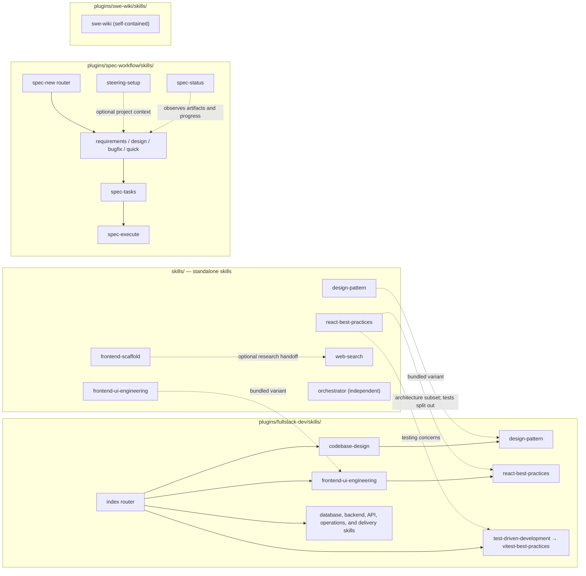

# Repository Instructions

## Keep README Files Current

When a change affects documented repository behavior, update the necessary `README.md` files in the
same change.

- Update the root `README.md` when adding, removing, or renaming a standalone skill or plugin.
- Update a plugin's `README.md` when its skills, entrypoint, installation, usage, or behavior changes.
- Update other scoped `README.md` files when their documented paths, commands, examples, or inventories become stale.
- Do not edit unrelated README content when the change has no documentation impact.
- Before finishing, verify that documented names match the filesystem and that changed links resolve.

## Skill and Plugin Dependency Graph

Standalone skills and plugin-bundled skills are separate deliverables. Solid arrows below are
router or workflow handoffs. Dotted arrows mark optional use or shared lineage; they are not runtime
imports and do not synchronize files automatically.

## Plugin Versions

When a plugin is updated, bump the `version` in that plugin's root `plugin.json` in the same change.
Use Semantic Versioning:

| Segment | Meaning                     | Description                                              |
| ------- | --------------------------- | -------------------------------------------------------- |
| Major   | Breaking change             | Incompatible behavior, schema or workflow change.        |
| Minor   | Backward-compatible feature | New behavior without breaking existing clients or users. |
| Patch   | Backward-compatible fix     | Corrective change without intended behavioral break.     |

Repository-only changes that do not alter a packaged plugin do not require a plugin version bump.
Before finishing a plugin change, verify that its version increased from the previous committed
value and that the manifest still passes the Agent Plugins schema.
