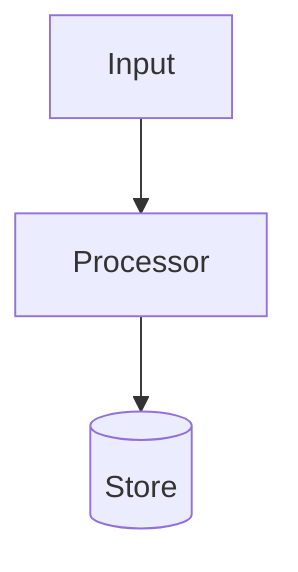
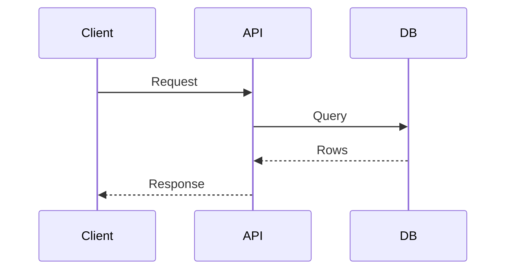

# SWE Wiki Conventions

## Directory Contract

```text
<wiki-root>/
├── .gitignore
├── AGENTS.md
├── raw/
│   └── <domain>/
│       └── source files
└── wiki/
    ├── index.md
    ├── log.md
    └── <domain>/
        ├── index.md
        ├── durable-page.md
        ├── <subdomain>/
        │   └── index.md
        └── sources/
            ├── index.md
            └── source-page.md
```

The root is a dedicated Git working tree; `.git/` is omitted from the diagram. `raw/` is immutable source material, `wiki/` is the maintained synthesis, and `AGENTS.md` is the local schema reminder for future agents. Track all knowledge content. Ignore only machine-generated files listed in `.gitignore`.

Organize both trees by one primary knowledge domain, using lowercase kebab-case segments such as `aws/iam` or `software-engineering/ai-agents`. The reserved `sources` segment is created only beneath a wiki domain for provenance pages. A page belongs to one canonical domain; use tags and cross-links rather than copies for secondary domains. Course chapters and source organization do not override the technical domain that owns the durable knowledge.

The machine-local config at `~/.config/swe-wiki/config.json` is outside the repository and stores only the schema version and selected root. Git's `origin` remote is the source of truth for the repository URL.

## Page Kinds

- `source`: one page per raw source with provenance, summary, extracted SWE atoms, impacted pages, and open questions. Store it under `wiki/<domain>/sources/`.
- `concept`: durable ideas, tradeoffs, algorithms, patterns, failure modes, and mental models.
- `decision`: ADR-like records. Include context, forces, decision, consequences, status, alternatives, and Mermaid when system relationships matter.
- `blueprint`: reusable architectures, implementation plans, protocols, data flows, or operational designs. Include Mermaid diagrams, component boundaries, and stepwise build notes.
- `practice`: best practices, checklists, testing strategies, review heuristics, operational playbooks.
- `convention`: coding standards, naming rules, API style, file layout, error handling, logging, comments, documentation rules.
- `system`: specific frameworks, libraries, services, repos, tools, vendors, or platforms.
- `question`: durable query answers that should compound into the wiki.

Store every non-source page directly in its owning domain directory. Page kind is metadata, not a directory axis.

## Frontmatter

Every wiki page except `index.md` and `log.md` uses:

```yaml
---
title: "Readable title"
kind: concept
domain: aws/iam
status: draft
tags: [swe]
sources: []
updated: 2026-07-06
confidence: medium
---
```

Allowed `kind`: `source`, `concept`, `decision`, `blueprint`, `practice`, `convention`, `system`, `question`.

Allowed `status`: `draft`, `evergreen`, `superseded`.

`domain` must match the page path. For example, durable page `wiki/aws/iam/least-privilege.md` and source page `wiki/aws/iam/sources/lesson.md` both use `domain: aws/iam`.

Use `sources` for raw file paths, URLs, or wiki source pages. Use `confidence` as `high`, `medium`, or `low`.

## Indexing

Every directory under `wiki/` that contains pages or subdirectories has a generated `index.md`. The root index lists only top-level domains. A nested index lists only its immediate subdomains and local pages, grouping local pages by kind. Raw directories do not receive indexes; source-page indexes provide their navigation.

Update the index chain on every ingest, durable query, migration, and lint repair. Each page row stays on one line:

```markdown
- [Readable title](readable-title.md) - one-line summary | tags: swe,architecture | updated: 2026-07-06 | sources: 2
```

Keep summaries concrete enough that an agent can choose pages from the local index before reading them. Prefer stable relative Markdown links. Index files do not use page frontmatter.

## Logging

`wiki/log.md` is chronological and append-only. Every entry starts with this parseable heading:

```markdown
## [2026-07-06 14:30] ingest | Source title
```

Allowed event kinds: `bootstrap`, `ingest`, `query`, `lint`, `migrate`.

Do not log synchronization events here. Git history is the sync audit trail.

Entry body:

```markdown
- Changed: wiki/backend/caching/sources/source-title.md, wiki/backend/caching/cache-invalidation.md
- Notes: New source strengthens the write-through cache guidance.
- Follow-ups: Compare against production incident notes.
```

The heading prefix must stay grep-friendly:

```bash
grep '^## \[' wiki/log.md | tail -5
```

## Ingest Extraction

Before ingestion writes anything, read the source, inspect the existing hierarchy, recommend a primary domain with reasoning and relevant pages, offer plausible alternatives, and wait for explicit approval. Copy local inputs into `raw/<domain>/`; never move or overwrite their originals.

Read the whole source, including code blocks, diagrams, tables, footnotes, and referenced local images when available.

Extract and file:

- Architecture: components, boundaries, data flow, control flow, protocols, dependencies, deployment topology.
- Decisions: context, constraints, alternatives, chosen option, consequences, rollback triggers.
- Blueprints: repeatable implementation shapes, sequence diagrams, state machines, rollout plans.
- Practices: testing, review, observability, incident response, migration, security, performance, reliability.
- Code conventions: naming, module boundaries, API contracts, error handling, logging, comments, documentation.
- Principles: tradeoffs, heuristics, anti-patterns, failure modes, rules of thumb.
- Evidence: source path, quote-sized anchors, examples, versions, dates, confidence.

Do not copy long passages. Synthesize, cite, and keep source provenance.

## Mermaid

Use Mermaid for architecture decisions and blueprints when it clarifies structure.

Common defaults:





Use diagrams to show boundaries, dependencies, data flow, lifecycle, failure handling, or rollout sequence. Skip diagrams for tiny convention pages where prose is clearer.

## Semantic Lint

After the script linter, check:

- Contradictions: pages disagree on a claim without naming the tension.
- Staleness: newer sources supersede old claims without marking `status: superseded` or adding notes.
- Orphans: important pages have no inbound links.
- Domain drift: frontmatter does not match the domain-first page or raw-source path.
- Missing pages: important concepts are mentioned repeatedly but have no page.
- Thin provenance: claims lack `sources` or page-level citations.
- Weak diagrams: decisions or blueprints describe architecture but have no Mermaid diagram.
- Index drift: local indexes are missing, list non-local content, or use summaries too vague to support search.
