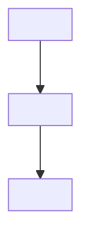
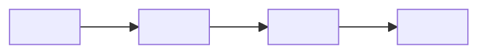

# Design Document: {{SPEC_TITLE}}

## Overview

<State the evidence-backed root cause, smallest shared fix, and unchanged behavior to preserve.>

## Key Design Decisions

- **<Decision>:** <Choice and evidence-backed reason.>

## Architecture



## Affected Hierarchy

```text
<entry caller>
└── <affected function or component>
    └── <root-cause owner>
```

<Show only the caller, ownership, and repository path needed to explain the defect and fix.>

## Root Cause and Fix



```pseudocode
<Root-cause or corrected algorithm when pseudocode prevents ambiguity>
```

## Changed Interfaces

### <Changed contract>

```pseudocode
<Stack-native changed signature, result, schema, or explicit pseudocode>
```

**Validates:** Bugfix <EB1, UB1>

## Data Model Changes

```pseudocode
<Changed fields, constraints, indexes, or migration>
```

<!-- When persistence is unchanged, replace the example with **Not applicable:** followed by an evidence-based reason. -->

## Error Handling

| Scenario | System Response | Caller or UI Recovery | Validates |
| --- | --- | --- | --- |
| <Failure or boundary> | <Typed result and state change> | <Recovery behavior> | Bugfix <EB1, UB1> |

## Regression Strategy

| Boundary | Test Evidence | Validates |
| --- | --- | --- |
| <Original defect> | <Reproducing regression test> | Bugfix <EB1> |
| <Preserved behavior> | <Characterization or related test> | Bugfix <UB1> |

## Traceability

| Source | Design Elements | Verification |
| --- | --- | --- |
| Bugfix <EB1, UB1> | <Affected hierarchy, changed interface, and fix flow> | <Regression evidence> |

<!-- Replace every placeholder before approval. Ground native code in inspected repository versions or current official documentation. -->
