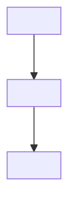
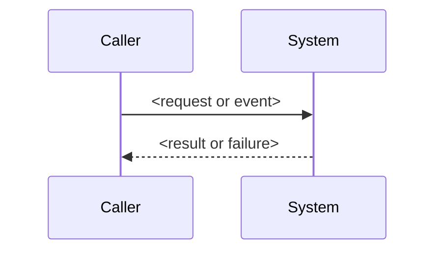

# Design Document: {{SPEC_TITLE}}

## Overview

<Summarize the chosen technical approach, inspected repository context, and important constraints.>

## Key Design Decisions

- **<Decision>:** <Choice and evidence-backed reason.>

## Architecture



<Explain ownership and the architectural boundary shown above.>

## Repository Structure

```text
<affected-root>/
├── <existing-or-new-unit>
└── <existing-or-new-unit>
```

<Show only production, test, configuration, and generated locations required by this spec.>

## Component Hierarchy

```text
<Entry component>
└── <Child component or service>
    └── <Collaborator>
```

<Show runtime composition and ownership, not a second repository tree.>

## Components and Interfaces

### <Component or Module>

**Responsibilities**

- <Single owned responsibility>

**Interface**

```pseudocode
<Stack-native public signature, schema, command, event, or explicit pseudocode>
```

**Validates:** Requirements <1.1>

## Data Models

### <Model or Schema>

```pseudocode
<Stack-native fields, types, constraints, indexes, and relationships>
```

<!-- When no persisted or exchanged model applies, replace the example with **Not applicable:** followed by an evidence-based reason. -->

## Operations

### <Queries, Mutations, Endpoints, Commands, or Events>

| Operation | Input | Output | Errors | Validates |
| --- | --- | --- | --- | --- |
| `<operation>` | `<input type>` | `<output type>` | `<typed error>` | Requirements <1.1> |

<!-- Use one table per operation category present in the selected stack. When no operation applies, use **Not applicable:** with an evidence-based reason. -->

## Flows and Strategies

### <Flow or Runtime Strategy>



```pseudocode
<Algorithm only when code or pseudocode prevents an ambiguous implementation>
```

<!-- Give every nontrivial flow, state transition, or runtime strategy its own subsection and Mermaid diagram. -->

## Correctness Properties

### Property 1: <Invariant name>

_For any_ <valid inputs and preconditions>, <invariant or observable property>.

**Validates:** Requirements <1.1>

<!-- Remove this section when no meaningful universal property exists. -->

## Error Handling

| Scenario | System Response | Caller or UI Recovery | Validates |
| --- | --- | --- | --- |
| <Failure or boundary> | <Typed result and state change> | <Recovery behavior> | Requirements <1.1> |

## Testing Strategy

| Behavior | Level | Evidence | Validates |
| --- | --- | --- | --- |
| <Observable behavior> | <Unit, integration, or end-to-end> | <Test target and proof> | Requirements <1.1> |

## Traceability

| Source | Design Elements | Verification |
| --- | --- | --- |
| Requirements <1.1> | <Components, models, operations, and flows> | <Test evidence> |

<!-- Replace every placeholder before approval. Ground native code in inspected repository versions or current official documentation. -->
