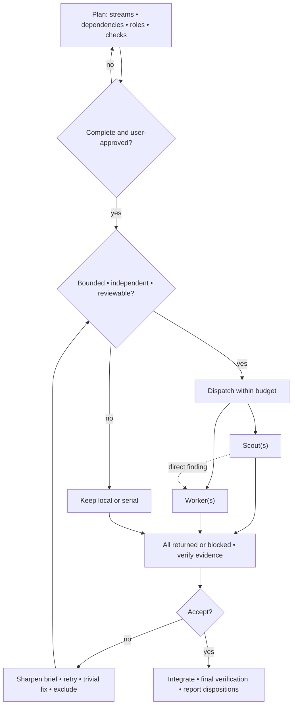

# Orchestrator

The coordinator stays user-facing and owns consequential approvals.

## Execution graph



The concurrency budget includes the coordinator.

## Roles

| Role         | Default model / reasoning | Assignment                                    |
| ------------ | ------------------------- | --------------------------------------------- |
| Scout        | `gpt-5.6-sol` / `low`     | Locate, trace, or find tests; read-only       |
| Worker       | `gpt-5.6-sol` / `medium`  | Implement one owned scope and run its checks  |
| Smart worker | `gpt-5.6-sol` / `high`    | Resolve difficult implementation or ambiguity |

Keep one family and the cheapest reviewable effort. Raise it for ambiguity,
risk, broad search, or weak review signals; reserve `ultra` for high-stakes
scattered context. Alternative: `gpt-5.6-terra` `medium`/`high`.

## Gates

**Plan:** every delegated node has one outcome, dependencies, ownership, role,
model/reasoning, context mode, merge criterion, and smallest proving check.

**Local:** trivial, judgment-continuous, live-system, or unstable work.

**Accept:** every claim verified against source, diff, log, test, or artifact;
every rejection resolved along the graph.

## Context and coordination

- Fresh: use `fork_turns: "none"`; restate safety, tool, mutation, and approval
  boundaries.
- Inherited: only for the goal or prior decisions. Full history inherits
  model/reasoning; use a positive turn count to override. Mark leaves: complete
  directly; do not spawn agents.
- Workers: give exclusive ownership and warn that teammates may edit elsewhere.
- Handoffs: message the teammate unblocked by a discovery and the coordinator.

## Brief

```text
Outcome: <one checkable result>
Context: <files, commands, constraints, user intent>
Ownership: <exclusive scope>
Context mode: <fresh or inherited; reason>
Authority: <read/write scope; delegation and approval limits>
Return: <findings, patch, output, or recommendation with evidence>
Stop: <when to ask instead of guess>
Notify: <teammate for a discovered dependency>
```
