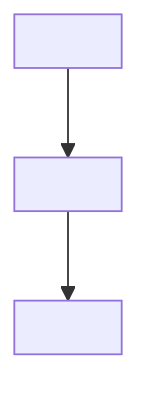

# Design Document: {{SPEC_TITLE}}

## Overview

<Summarize the chosen technical approach, repository context, and important constraints.>

---

## Architecture



<Explain component boundaries, control flow, and why this architecture fits the requirements or bugfix boundaries.>

---

## Components and Interfaces

### <Component or Module>

**Responsibilities**

- <Responsibility>

**Interface**

```text
<Public API, schema, command, event, or contract>
```

**Validates:** Requirements <1.1> or Bugfix <EB1, UB1>

---

## Data Models

### <Model>

```text
<Fields, types, constraints, and relationships>
```

---

## Correctness Properties

### Property 1: <Invariant name>

_For any_ <valid inputs and preconditions>, <invariant or observable property>.

**Validates:** Requirements <1.1> or Bugfix <EB1, UB1>

<!-- Remove this section when no meaningful universal property exists. -->

---

## Error Handling

| Scenario              | Handling                       | Validation                       |
| --------------------- | ------------------------------ | -------------------------------- |
| <Failure or boundary> | <System response and recovery> | <Requirement, behavior, or test> |

---

## Testing Strategy

- **Unit:** <Pure logic and component contracts>
- **Integration:** <Boundaries, persistence, APIs, or events>
- **End-to-end:** <Critical user or operational journey>
- **Regression:** <Bug reproduction and unchanged behavior when applicable>

<!-- Replace or remove every placeholder before approval. Use only testing layers that materially apply. -->
