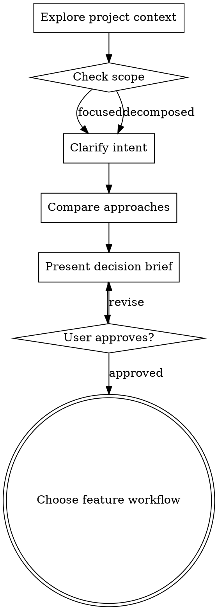

# Brainstorming Before Specification

Turn a feature idea into an approved decision brief through focused collaborative dialogue. Use this preflight before choosing a feature workflow; let defect work begin with reproduction evidence and behavioral boundaries.

## Contents

- [Completion Gate](#completion-gate)
- [Checklist](#checklist)
- [Understand the Idea](#understand-the-idea)
- [Compare Approaches](#compare-approaches)
- [Present the Decision Brief](#present-the-decision-brief)
- [Design for Isolation and Clarity](#design-for-isolation-and-clarity)
- [Work in Existing Codebases](#work-in-existing-codebases)
- [Use Visual Support Deliberately](#use-visual-support-deliberately)
- [Self-Review](#self-review)
- [Key Principles](#key-principles)

## Completion Gate

Keep the repository unchanged while brainstorming. Enter the specification workflow only after the user confirms shared understanding by approving a concise brief covering the goal, success criteria, scope, constraints, and chosen approach.

Even small changes benefit from this gate. A short brief may be only a few sentences, but it must expose assumptions before artifact creation or implementation begins.

## Checklist

Complete these steps in order:

1. **Explore project context** — inspect relevant files, documentation, conventions, and recent history.
2. **Check scope** — confirm the idea is one independently evolvable capability.
3. **Clarify intent** — ask one focused question at a time about purpose, constraints, and success criteria.
4. **Compare approaches** — present two or three viable approaches with trade-offs and a recommendation.
5. **Approve the direction** — present the decision brief in sections scaled to the idea's complexity and revise it until approved.
6. **Choose the workflow** — return to the main specification instructions and recommend Requirements-First, Design-First, or Quick Plan.

The terminal state is an approved decision brief followed by feature workflow selection.

## Understand the Idea

- Inspect the current project before asking detailed questions or proposing architecture.
- Assess scope early. When a request combines independent subsystems, decompose it into separate capabilities, explain their relationships and implementation order, and brainstorm only the first capability through this process.
- Interview me relentlessly about every aspect of this until we reach a shared understanding. Walk down each relevant branch of the decision tree and resolve dependencies between decisions in order.
- Ask one question per message and wait for the answer before continuing. Break a broad topic into successive questions, and include a recommended answer with concise reasoning for every question.
- Discover facts from the repository, documentation, and available tools instead of asking the user. Put every material product or technical decision to the user; recommendations inform those decisions but do not replace them.
- Prefer multiple-choice questions when the choices are meaningful; use an open question when the answer space is genuinely unknown.
- Establish purpose, audience, observable success, constraints, boundaries, and important failure behavior.
- Resolve assumptions that would materially change the workflow recommendation or chosen approach.

## Compare Approaches

- Present two or three genuinely different approaches with their costs, risks, and operational consequences.
- Lead with the recommended approach and explain why it best fits the known constraints.
- Apply YAGNI: remove capabilities that do not contribute to the approved success criteria.
- Return to clarification when an approach exposes a missing requirement or incompatible constraint.

## Present the Decision Brief

Scale the brief to the decision. Use a few sentences for straightforward work and short sections for nuanced work. Cover only what the user needs to approve before specification:

- Goal and user or operational value
- Success criteria and boundaries
- Constraints and relevant repository context
- Chosen approach and rejected alternatives
- Expected components, data flow, error behavior, and testing direction when these affect workflow choice

Ask for approval after each material section. Revise the brief when feedback changes the direction.

## Design for Isolation and Clarity

- Prefer units with one clear purpose and explicit interfaces.
- For each proposed unit, identify what it does, how consumers use it, and what it depends on.
- Choose boundaries that let a reader understand the unit without reading its internals and let the implementation change without breaking consumers.
- Treat large or tangled files in the affected path as design evidence. Include targeted cleanup when it directly serves the feature; leave unrelated refactoring outside the brief.

## Work in Existing Codebases

- Follow established repository patterns unless the requested change exposes a concrete reason to adjust them.
- Ground claims about architecture, interfaces, dependencies, and tests in inspected code.
- Prefer the smallest approach that fits existing boundaries and satisfies the approved success criteria.

## Use Visual Support Deliberately

Use an available diagram, wireframe, or comparison when the user would understand a spatial, interaction, or architectural choice better by seeing it. Keep textual questions and trade-off decisions in text. Decide independently for each question; a UI topic alone does not require a visual.

## Self-Review

Before asking for final approval, check the brief for:

1. **Scope:** One focused capability remains.
2. **Completeness:** Goal, success criteria, boundaries, constraints, and approach are explicit.
3. **Consistency:** The approach fits the repository context and stated constraints.
4. **Ambiguity:** Each material decision has one intended interpretation.
5. **Readiness:** No unresolved choice would change the workflow recommendation.

Resolve every finding in the brief or explicitly with the user. Then return to workflow selection without creating specification artifacts during this preflight.

## Key Principles

- **One question at a time** — keep each interaction easy to answer.
- **Meaningful choices** — use multiple choice when it clarifies a real trade-off.
- **YAGNI** — keep the approved direction focused.
- **Alternative comparison** — make the chosen direction deliberate.
- **Incremental validation** — confirm material sections as understanding develops.
- **Flexible refinement** — return to earlier questions when new information changes the decision.
