# Planning Test-Driven Development

Write `tasks.md` so every behavior change is implemented through a visible Red-Green-Refactor cycle: write the test first, watch it fail for the expected reason, implement the minimum behavior, watch it pass, and refactor while green.

**Core principle:** A test proves it can detect missing behavior only when the implementer observes the expected failure before production code exists.

## Contents

- [When the Plan Requires TDD](#when-the-plan-requires-tdd)
- [The Iron Law](#the-iron-law)
- [Red-Green-Refactor](#red-green-refactor)
- [Good Test Qualities](#good-test-qualities)
- [Why Order Matters](#why-order-matters)
- [Common Rationalizations](#common-rationalizations)
- [Planning Red Flags](#planning-red-flags)
- [Bugfix Pattern](#bugfix-pattern)
- [When Planning Gets Stuck](#when-planning-gets-stuck)
- [Testing Anti-Patterns](#testing-anti-patterns)
- [Task-Plan Verification Checklist](#task-plan-verification-checklist)

## When the Plan Requires TDD

Use the complete cycle for:

- New features
- Bug fixes
- Refactoring
- Observable behavior changes

Record a `[TDD Exception]` only after explicit user approval. Typical candidates are throwaway exploration, generated output, or configuration-only work. The task must preserve the reason, approval, and an exact verification check.

## The Iron Law

```text
PRODUCTION BEHAVIOR FOLLOWS A TEST THAT FAILED FOR THE EXPECTED REASON
```

Each behavior task keeps the test and implementation in the same task. Arrange its entries in this exact order:

1. `RED`
2. `Verify RED`
3. `GREEN`
4. `Verify GREEN`
5. `REFACTOR`

## Red-Green-Refactor

```dot
digraph tdd_cycle {
    rankdir=LR;
    red [label="RED\nWrite failing test", shape=box, style=filled, fillcolor="#ffcccc"];
    verify_red [label="Verify expected failure", shape=diamond];
    green [label="GREEN\nMinimal implementation", shape=box, style=filled, fillcolor="#ccffcc"];
    verify_green [label="Verify focused and related tests", shape=diamond];
    refactor [label="REFACTOR\nClean up", shape=box, style=filled, fillcolor="#ccccff"];
    next [label="Next behavior", shape=ellipse];

    red -> verify_red;
    verify_red -> green [label="correct failure"];
    verify_red -> red [label="wrong failure"];
    green -> verify_green;
    verify_green -> green [label="failing"];
    verify_green -> refactor [label="green"];
    refactor -> verify_green [label="stay green"];
    verify_green -> next;
}
```



### RED — Plan One Focused Failing Test

Specify one minimal test that demonstrates the desired behavior through the intended public interface.

<Good>

```typescript
test("retries failed operations 3 times", async () => {
	let attempts = 0;
	const operation = async () => {
		attempts++;
		if (attempts < 3) throw new Error("fail");
		return "success";
	};

	const result = await retryOperation(operation);

	expect(result).toBe("success");
	expect(attempts).toBe(3);
});
```

The name states one behavior, the assertions show intent, and the test exercises real code.

</Good>

<Bad>

```typescript
test("retry works", async () => {
	const operation = jest
		.fn()
		.mockRejectedValueOnce(new Error())
		.mockRejectedValueOnce(new Error())
		.mockResolvedValueOnce("success");

	await retryOperation(operation);

	expect(operation).toHaveBeenCalledTimes(3);
});
```

The name is vague and the assertion emphasizes mock interaction instead of the observable result.

</Bad>

The `RED` entry must name the test file, behavior, setup, and assertion precisely enough to implement without inventing coverage.

### Verify RED — Require the Expected Failure

Record the exact focused command and expected failure. The implementer must confirm:

- The test fails rather than errors.
- The failure message matches the missing behavior.
- The failure comes from the unimplemented behavior rather than a typo, bad fixture, or broken environment.

A test that passes immediately demonstrates existing behavior or an ineffective assertion. A test that errors needs repair before implementation begins.

```markdown
- **Verify RED:** Run `npm test -- retry.test.ts -t "retries failed operations"`; expect the result assertion to fail because `retryOperation` performs only one attempt.
```

### GREEN — Plan the Minimum Implementation

Name the smallest production change that satisfies the failing test. Keep unrelated features, abstractions, and cleanup outside this entry.

<Good>

```typescript
async function retryOperation<T>(operation: () => Promise<T>): Promise<T> {
	for (let attempt = 1; attempt <= 3; attempt++) {
		try {
			return await operation();
		} catch (error) {
			if (attempt === 3) throw error;
		}
	}
	throw new Error("unreachable");
}
```

The implementation contains only the behavior demanded by the test.

</Good>

<Bad>

```typescript
async function retryOperation<T>(
	operation: () => Promise<T>,
	options?: {
		maxRetries?: number;
		backoff?: "linear" | "exponential";
		onRetry?: (attempt: number) => void;
	},
): Promise<T> {
	// Unapproved behavior and abstractions.
}
```

The design exceeds the tested requirement.

</Bad>

### Verify GREEN — Prove Focused and Related Behavior

Record the exact command that reruns the focused test and the smallest related regression suite. State the expected successful output and relevant warning expectations.

When the focused test fails, adjust production code while preserving the approved test. When related tests fail, resolve the regression before refactoring.

### REFACTOR — Improve Structure While Green

Plan cleanup after the behavior passes:

- Remove duplication.
- Improve names.
- Extract focused helpers.
- Preserve interfaces and observable behavior.

Record the command that proves tests remain green. When no cleanup is warranted, state that decision and still rerun the focused or related check.

## Good Test Qualities

| Quality          | Good                                          | Weak                                  |
| ---------------- | --------------------------------------------- | ------------------------------------- |
| Minimal          | One observable behavior                       | Several behaviors joined by “and”     |
| Clear            | Name describes the result and condition       | Generic names such as `test1`         |
| Intent-revealing | Demonstrates the desired API                  | Encodes implementation details        |
| Behavioral       | Asserts outputs or externally visible effects | Asserts mock existence or call trivia |

Prefer real collaborators. Introduce mocks only where an external or slow boundary requires isolation and the task preserves the side effects the behavior depends on.

## Why Order Matters

Tests written after implementation pass immediately, so they provide no evidence that they detect missing behavior. They also inherit the implementation's assumptions: they tend to explain what was built rather than define what should be built.

Manual testing has no durable record, is difficult to repeat consistently, and is easy to narrow under time pressure. Automated test-first work turns the expected behavior and regression boundary into repeatable evidence.

Exploration is compatible with TDD when exploratory code is discarded. Begin the production change from the failing test after the interface and behavior are understood.

## Common Rationalizations

| Rationalization                          | Planning response                                                                        |
| ---------------------------------------- | ---------------------------------------------------------------------------------------- |
| “Too simple to test”                     | Specify the small test; simple behavior still regresses.                                 |
| “Tests after achieve the same goal”      | Require an observed RED result to prove the test detects absence.                        |
| “Manual testing is faster”               | Record a repeatable focused command and expected evidence.                               |
| “Existing code has no tests”             | Add characterization or regression coverage around the changed behavior.                 |
| “The test needs too many mocks”          | Simplify the boundary or move isolation to the true external dependency.                 |
| “Exploration must come first”            | Discard exploration and start production work from RED.                                  |
| “Keep the implementation as a reference” | Keep the desired interface in the design, then implement fresh from the test.            |
| “TDD will slow delivery”                 | Compare it with repeated debugging and regression diagnosis, not with unverified coding. |

## Planning Red Flags

Revise a task plan when it contains:

- Production steps before `Verify RED`
- A `RED` entry without a named assertion
- A verification command without its expected failure or success
- A test that can pass before the behavior exists
- Tests deferred to another task or “later”
- Mock assertions standing in for real behavior
- Refactoring mixed into `GREEN`
- A TDD exception without recorded user approval
- A behavior task missing any cycle entry

## Bugfix Pattern

For a defect, make the reproduced symptom the first failing regression test.

```markdown
- [ ] 1. Reject empty email submissions
  - **RED:** Add `test_rejects_empty_email` asserting the public submission result is `Email required`.
  - **Verify RED:** Run `npm test -- submit-form.test.ts -t "rejects empty email"`; expect the assertion to receive no error.
  - **GREEN:** Add the smallest empty-value guard in `submitForm`.
  - **Verify GREEN:** Run the focused test and the form validation suite; expect both to pass.
  - **REFACTOR:** Consolidate validation only if duplication remains, then rerun the form validation suite.
  - _Bugfix: EB1, UB1_
```

The RED result proves the regression test detects the original defect; the related suite protects unchanged behavior.

## When Planning Gets Stuck

| Problem                        | Response                                                                       |
| ------------------------------ | ------------------------------------------------------------------------------ |
| The API is unknown             | Write the interface the test should use, then synchronize it into `design.md`. |
| The test is complicated        | Simplify the interface or split the behavior.                                  |
| Every dependency needs mocking | Introduce a clear seam around the true external boundary.                      |
| Test setup is large            | Extract test helpers; if it remains large, simplify the design.                |
| Existing behavior is unclear   | Add a characterization test before the behavior-changing cycle.                |

## Testing Anti-Patterns

When tasks add mocks, test utilities, or production interfaces used only by tests, also read [testing-anti-patterns.md](testing-anti-patterns.md). Apply its checks while selecting boundaries and assertions.

## Task-Plan Verification Checklist

Before approving `tasks.md`, confirm:

- [ ] Every behavior task contains the five cycle entries in exact order.
- [ ] Every RED entry names one focused behavior and assertion.
- [ ] Every Verify RED entry names a command and expected failure reason.
- [ ] Every GREEN entry is limited to the behavior required by RED.
- [ ] Every Verify GREEN entry covers the focused test and relevant regressions.
- [ ] Every REFACTOR entry preserves green evidence.
- [ ] Tests prefer real behavior and use mocks only at understood boundaries.
- [ ] Edge cases and errors from the approved spec have tasks.
- [ ] Every exception records its reason, explicit user approval, and check.

The plan is TDD-ready only when every applicable box is checkable from the artifact itself.
