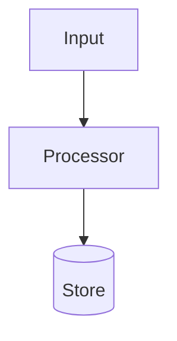
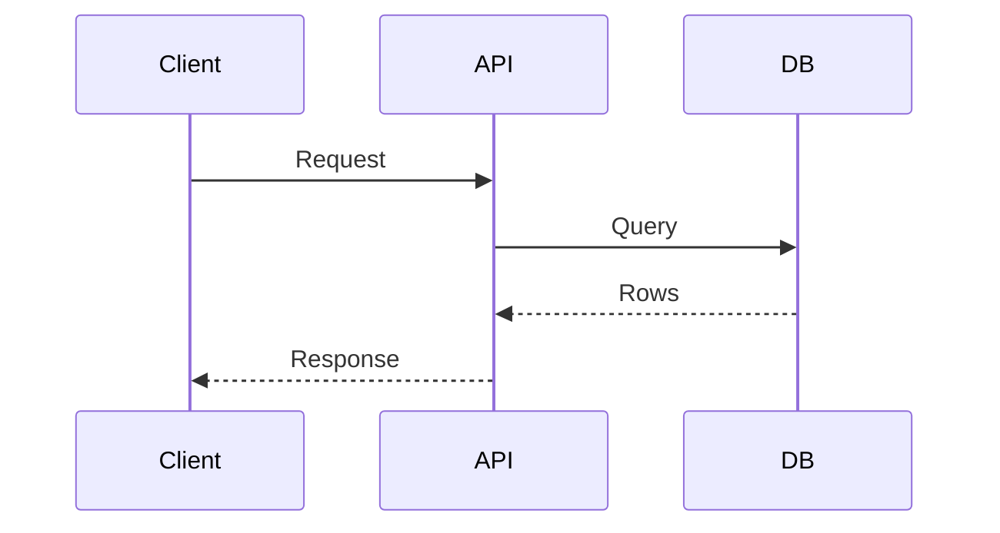

# SWE Wiki Conventions

## Directory Contract

```text
<wiki-root>/
├── AGENTS.md
├── raw/
└── wiki/
    ├── index.md
    ├── log.md
    ├── sources/
    ├── concepts/
    ├── decisions/
    ├── blueprints/
    ├── practices/
    ├── conventions/
    ├── systems/
    └── questions/
```

`raw/` is immutable source material. `wiki/` is the maintained synthesis. `AGENTS.md` is the local schema reminder for future agents.

## Page Kinds

- `sources/`: one page per raw source with provenance, summary, extracted SWE atoms, impacted pages, and open questions.
- `concepts/`: durable ideas, tradeoffs, algorithms, patterns, failure modes, and mental models.
- `decisions/`: ADR-like records. Include context, forces, decision, consequences, status, alternatives, and Mermaid when system relationships matter.
- `blueprints/`: reusable architectures, implementation plans, protocols, data flows, or operational designs. Include Mermaid diagrams, component boundaries, and stepwise build notes.
- `practices/`: best practices, checklists, testing strategies, review heuristics, operational playbooks.
- `conventions/`: coding standards, naming rules, API style, file layout, error handling, logging, comments, documentation rules.
- `systems/`: specific frameworks, libraries, services, repos, tools, vendors, or platforms.
- `questions/`: durable query answers that should compound into the wiki.

## Frontmatter

Every wiki page except `index.md` and `log.md` uses:

```yaml
---
title: "Readable title"
kind: concept
status: draft
tags: [swe]
sources: []
updated: 2026-07-06
confidence: medium
---
```

Allowed `kind`: `source`, `concept`, `decision`, `blueprint`, `practice`, `convention`, `system`, `question`.

Allowed `status`: `draft`, `evergreen`, `superseded`.

Use `sources` for raw file paths, URLs, or wiki source pages. Use `confidence` as `high`, `medium`, or `low`.

## Indexing

`wiki/index.md` is content-oriented. Update it on every ingest, durable query, and lint repair. Organize by page kind. Each row should be one line:

```markdown
- [Readable title](concepts/readable-title.md) - one-line summary | tags: swe,architecture | updated: 2026-07-06 | sources: 2
```

Keep summaries concrete enough that an agent can choose pages from the index before reading them. Prefer stable relative markdown links.

## Logging

`wiki/log.md` is chronological and append-only. Every entry starts with this parseable heading:

```markdown
## [2026-07-06 14:30] ingest | Source title
```

Allowed event kinds: `bootstrap`, `ingest`, `query`, `lint`.

Entry body:

```markdown
- Changed: wiki/sources/source-title.md, wiki/concepts/cache-invalidation.md
- Notes: New source strengthens the write-through cache guidance.
- Follow-ups: Compare against production incident notes.
```

The heading prefix must stay grep-friendly:

```bash
grep '^## \[' wiki/log.md | tail -5
```

## Ingest Extraction

Read the whole source, including code blocks, diagrams, tables, footnotes, and referenced local images when available.

Extract and file:

- Architecture: components, boundaries, data flow, control flow, protocols, dependencies, deployment topology.
- Decisions: context, constraints, alternatives, chosen option, consequences, rollback triggers.
- Blueprints: repeatable implementation shapes, sequence diagrams, state machines, rollout plans.
- Practices: testing, review, observability, incident response, migration, security, performance, reliability.
- Code conventions: naming, module boundaries, API contracts, error handling, logging, comments, documentation.
- Principles: tradeoffs, heuristics, anti-patterns, failure modes, rules of thumb.
- Evidence: source path, quote-sized anchors, examples, versions, dates, confidence.

Do not copy long passages. Synthesize, cite, and keep source provenance.

## Mermaid

Use Mermaid for architecture decisions and blueprints when it clarifies structure.

Common defaults:





Use diagrams to show boundaries, dependencies, data flow, lifecycle, failure handling, or rollout sequence. Skip diagrams for tiny convention pages where prose is clearer.

## Semantic Lint

After the script linter, check:

- Contradictions: pages disagree on a claim without naming the tension.
- Staleness: newer sources supersede old claims without marking `status: superseded` or adding notes.
- Orphans: important pages have no inbound links.
- Missing pages: important concepts are mentioned repeatedly but have no page.
- Thin provenance: claims lack `sources` or page-level citations.
- Weak diagrams: decisions or blueprints describe architecture but have no Mermaid diagram.
- Index drift: summaries are too vague to support search.
